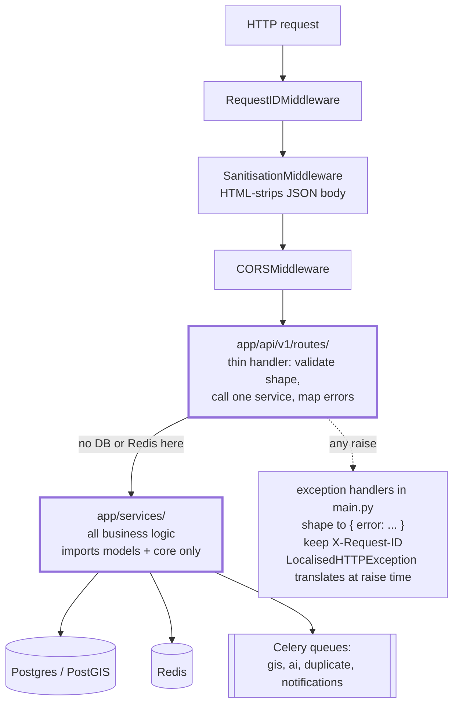
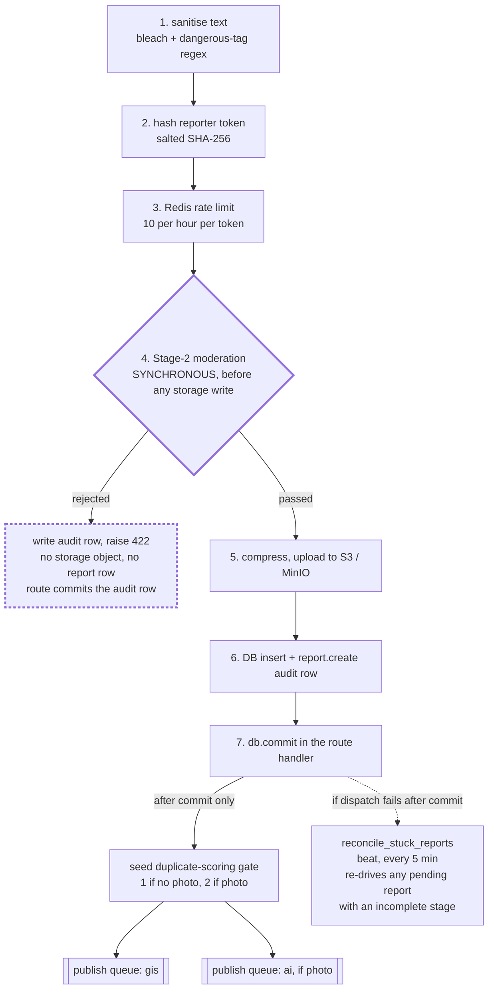
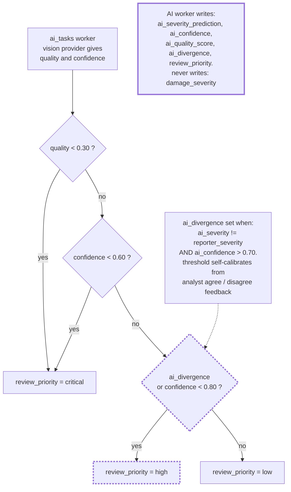
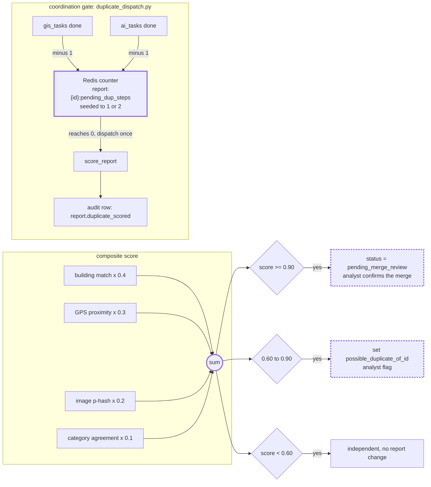
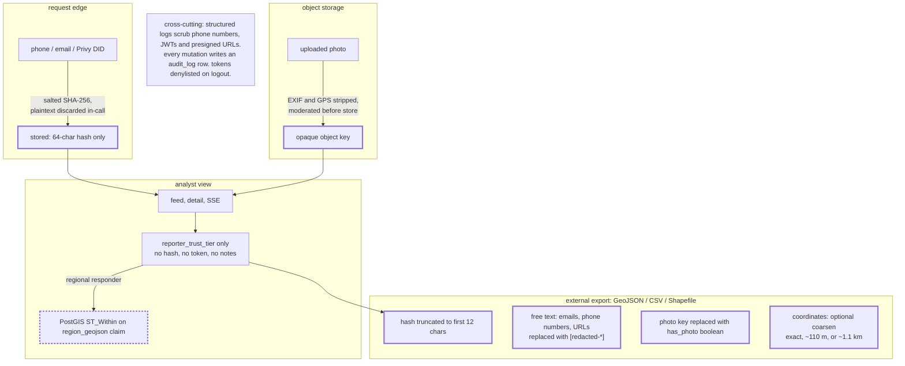

# CrisisMap backend: architecture diagrams

Five diagrams, drawn from the code on branch `feat/privy-email-auth` after
the 2026-09-10 remediation round. They render natively on GitHub and in most
Markdown viewers (Mermaid). The technical validation report refers to them by
number.

Reading conventions:

* Every box is a module that exists under `app/`.
* Every labelled arrow is a call or a queue publish you can find in the
  source.
* A node tagged `signal` is the mechanism the diagram exists to explain.
* A node tagged `human` is a point where control passes to an analyst.

---

## Figure 1: request lifecycle and layer discipline

Every request goes through the same middleware chain and then a strict
three-layer stack. Routes hold no database or Redis imports. Services never
import from `app.api`. Errors are reshaped to a single `{"error": ...}`
envelope on the way out, with the request id preserved.

Static analysis confirms the enforced edge: no `sqlalchemy` or `redis`
import appears in `app/api/`, and no `app.api` import appears in
`app/services/`. Enums live in one place, `app/models/enums.py`.

---

## Figure 2: report submission, the single orchestrator

`submission_service.create_report()` runs one ordered sequence. Two
properties matter here. First, content is moderated before any storage
object is created, so a rejected image leaves nothing in object storage and
one audit row. Second, background jobs are published by the route after the
database commit, which closes a worker "row not found" race. If that publish
still fails, a scheduled reconciliation sweep re-drives the report.

The perceptual hash used for deduplication is written later, by the AI
worker, on the stored compressed image. There is one hash implementation in
the codebase (`image_service.compute_phash`, DCT p-hash). Before the
remediation round there were two, on two different algorithms, writing the
same column: see audit finding H-2.

---

## Figure 3: AI triage, advisory and never authoritative

The vision model writes only `ai_*` columns and a `review_priority`. It
never touches `damage_severity`. The reporter's classification is immutable
once submitted. Routing is a deterministic function of quality and
confidence. When the model's severity guess differs from the reporter's at
high confidence, that is a signal to route to a human, not a correction to
apply.

In the simulation the routing decision is recomputed for every report,
independently, from the stored `ai_*` columns and compared with what the
pipeline actually assigned. Agreement was 100 percent across 90 reports with
AI output (see the technical validation report, section 2).

---

## Figure 4: duplicate detection, one score, one run per report

An incoming report is scored against nearby candidates on a weighted
composite of four signals. The score maps to one of three actions. A Redis
counter coordinates the asynchronous fan-in so that `score_report` runs
exactly once per report, after both feeding stages have finished, in
whatever order they finish. The scorer no-ops unless the report is still
`pending` (idempotent), and writes a durable audit row so a lost counter can
be reconstructed.

In the clean simulation run every one of 115 reports produced exactly one
terminal dedup outcome (94 `report.duplicate_scored` plus 21
`report.pending_merge_review`). Precision, recall and F1 against the planted
duplicate clusters were all 1.0. That result depends on the L-1 fix in this
remediation round: the candidate-loading query used to abort the
transaction on an edge case, killing `score_report` for part of the batch.

---

## Figure 5: responsible data handling at each boundary

The system is built so a login identifier never reaches disk, and reporter
free text never leaves in an export without scrubbing. This diagram traces
one report's personal data across four boundaries.

The export column here reflects the M-5 fix: free-text scrubbing and the
`has_photo` boolean are new in this round; hash truncation and identifier
exclusion were already in place. The honest caveat is stated plainly in the
impact brief: a single fast SHA-256 over a low-entropy phone-number space is
pseudonymisation, not strong anonymisation, and an HMAC key held in a KMS
rather than in `.env` is the documented upgrade.
